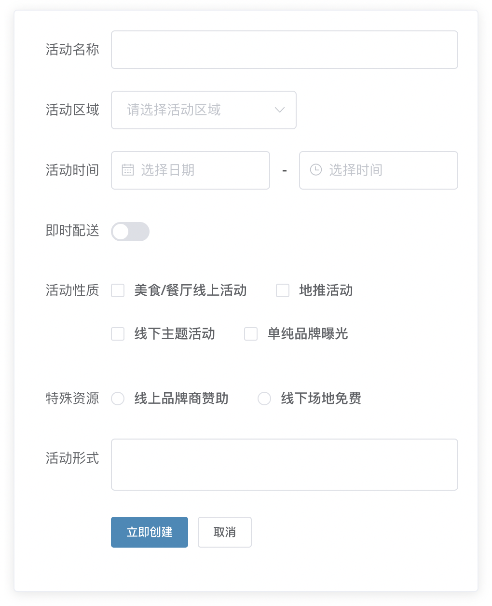

# 案例测试项目

## 项目说明

该项目用于测试各种第三方库。

## 项目启动

### 下载依赖
```
npm install / cnpm install / yarn
```

### 启动命令
```
npm run serve / dev / start
```

### 项目打包
```
npm run build
```

## 界面展示

### 1、首页


### 2、登录页面


### 3、列表界面


### 4、表单界面


### 5、代码界面


### 6、关系图表


### 7、diff案例


### 8、设置界面

