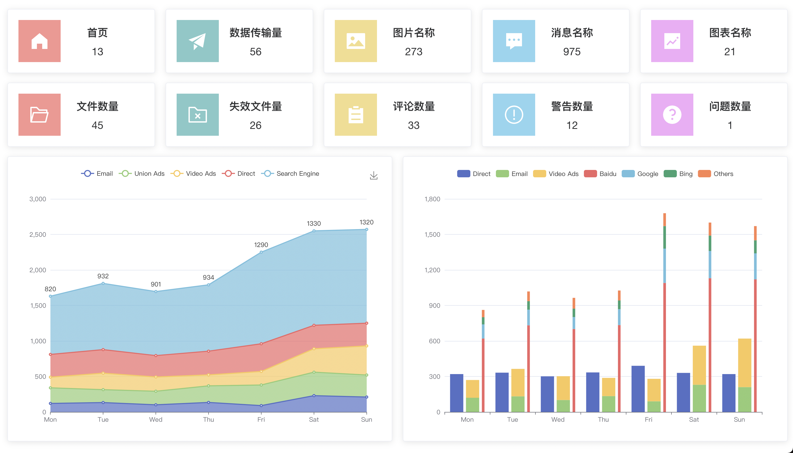
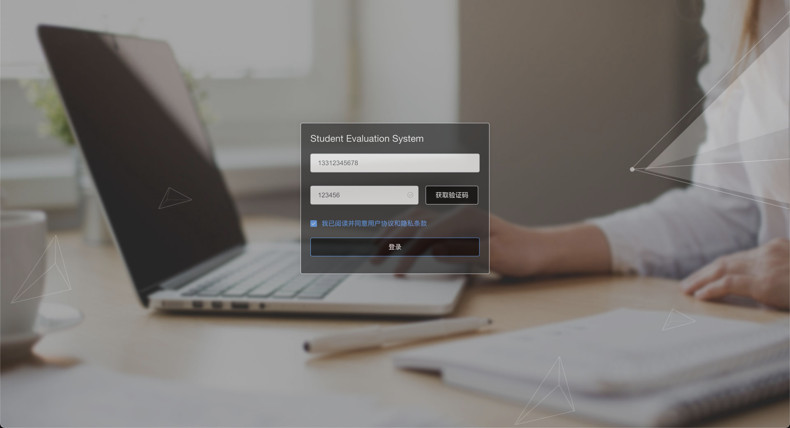
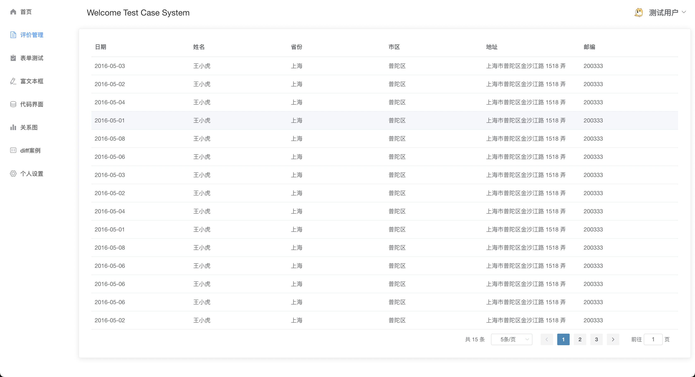
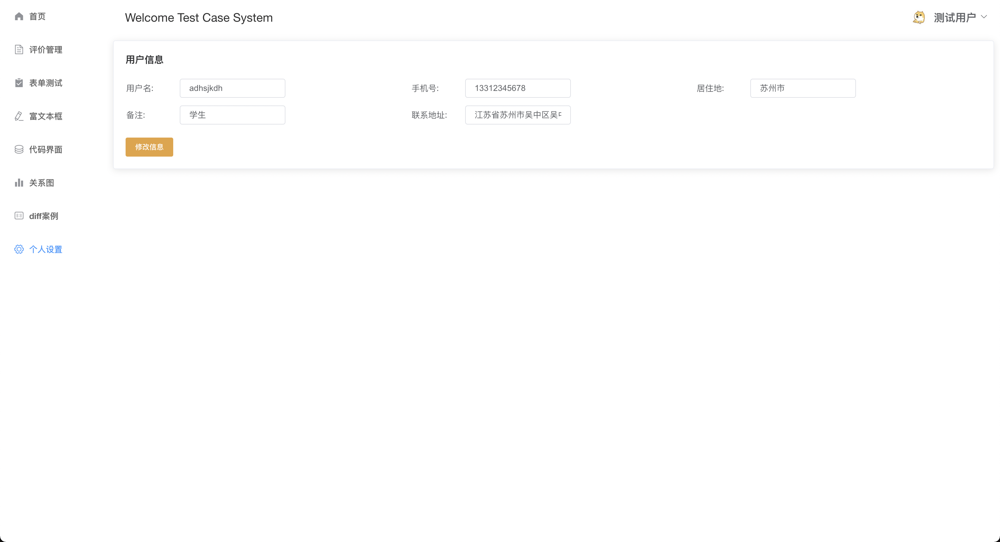
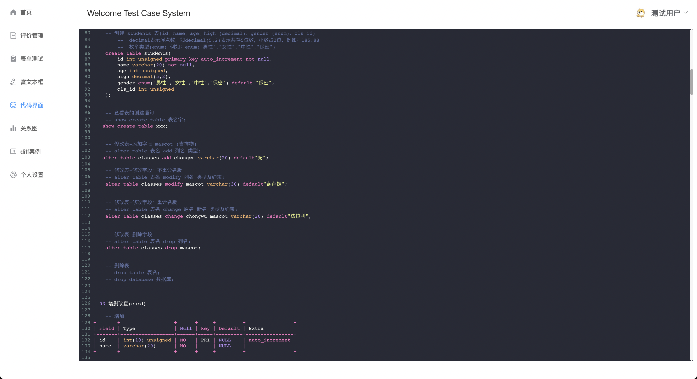
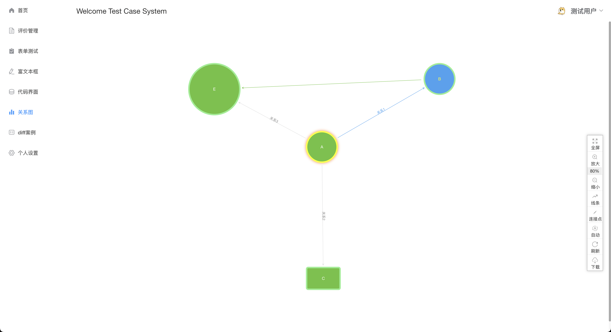
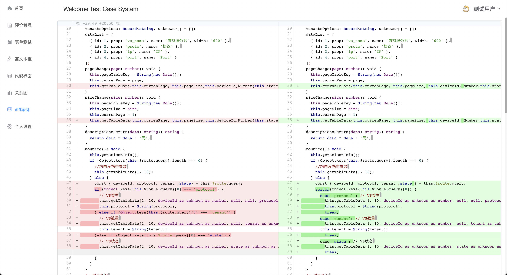

# 案例测试项目

## 项目说明

该项目用于测试各种第三方库。

## 项目启动

### 下载依赖
```
npm install / cnpm install / yarn
```

### 启动命令
```
npm run serve / dev / start
```

### 项目打包
```
npm run build
```

## 界面展示

### 1、首页
#### - 使用库：echarts
#### - GitHub地址：[echarts](https://github.com/apache/echarts)
#### - 界面效果：
</img>

### 2、登录页面
</img>

### 3、列表界面
#### - 使用库：element-ui v2
#### - GitHub地址：[element-ui](https://github.com/ElemeFE/element)
#### - 界面效果：
</img>
</img>

### 4、编辑器界面
#### - 使用库：vue-quill-editor
#### - GitHub地址：[vue-quill-editor](https://github.com/surmon-china/vue-quill-editor)
#### - 界面效果：
</img>

### 5、代码界面
#### - 使用库：vue-codemirror
#### - GitHub地址：[vue-codemirror](https://github.com/surmon-china/vue-codemirror)
#### - 界面效果：
</img>

### 6、关系图表
#### - 使用库：relation-graph
#### - GitHub地址：[relation-graph](https://github.com/seeksdream/relation-graph)
#### - 界面效果：
</img>

### 7、diff案例
#### - 使用库：vue-code-diff
#### - GitHub地址：[vue-code-diff](https://github.com/ddchef/vue-code-diff)
#### - 界面效果：
</img>

### 8、拖拽案例
#### - 使用库：vuedraggable
#### - GitHub地址：[vuedraggable](https://github.com/SortableJS/Vue.Draggable)
#### - 界面效果：
</img>

### 9、README文档
#### - 使用库：vue-markdown
#### - GitHub地址：[vue-markdown](https://github.com/zhaoxuhui1122/vue-markdown)